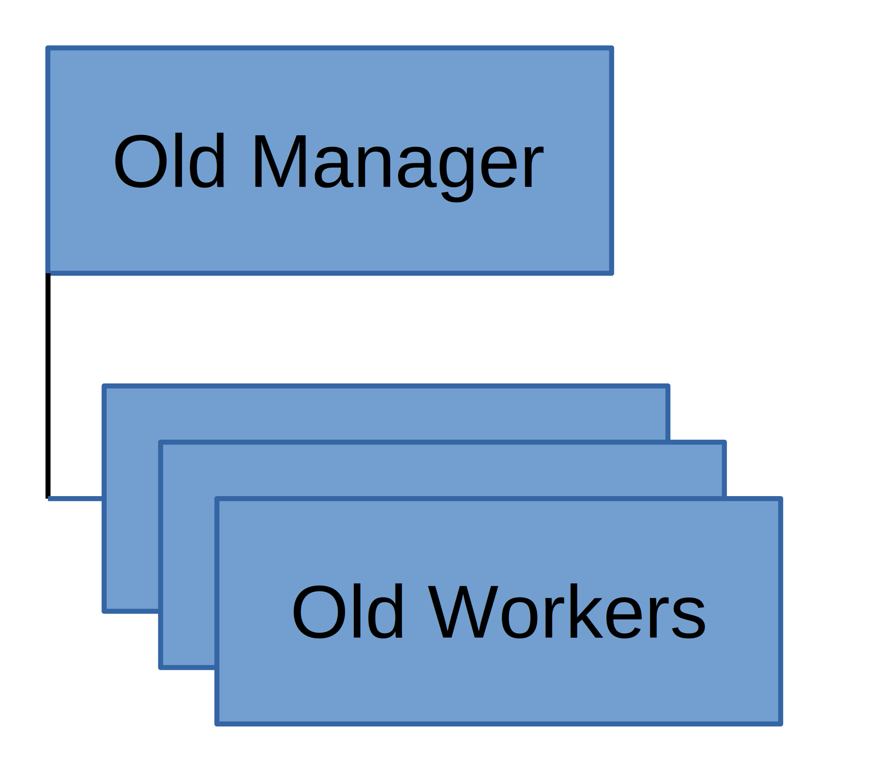
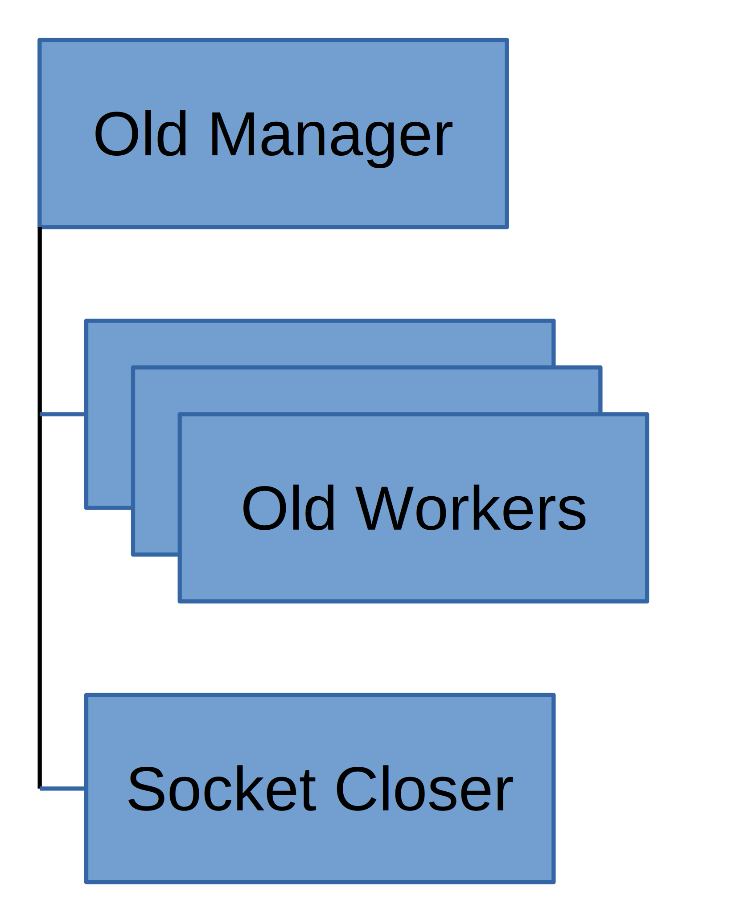
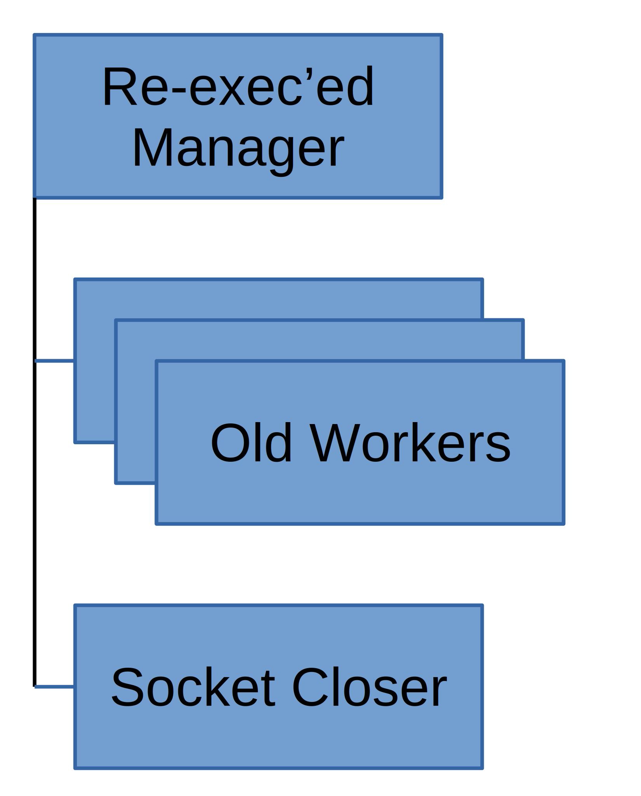
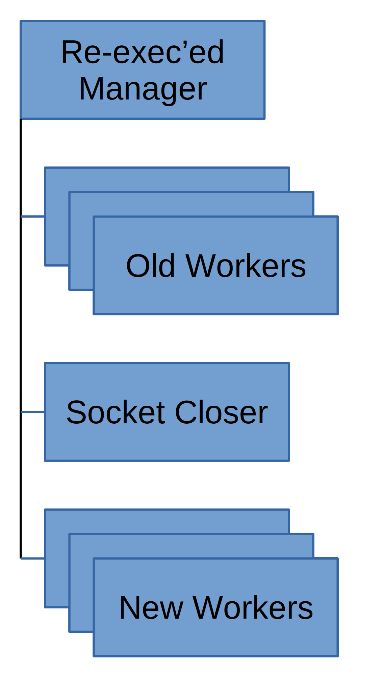
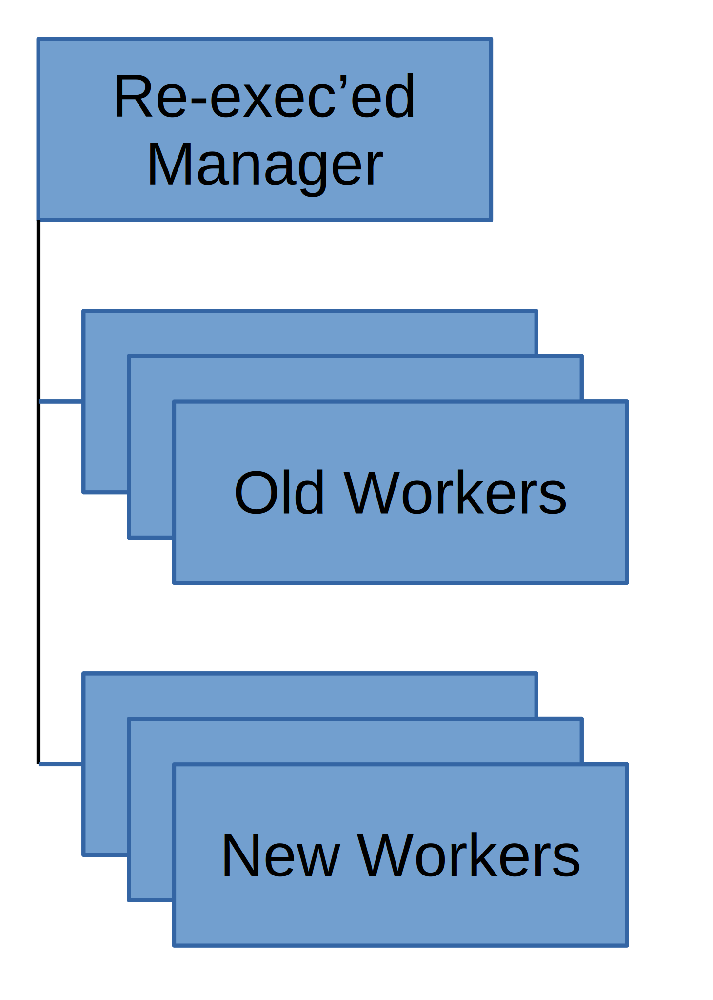
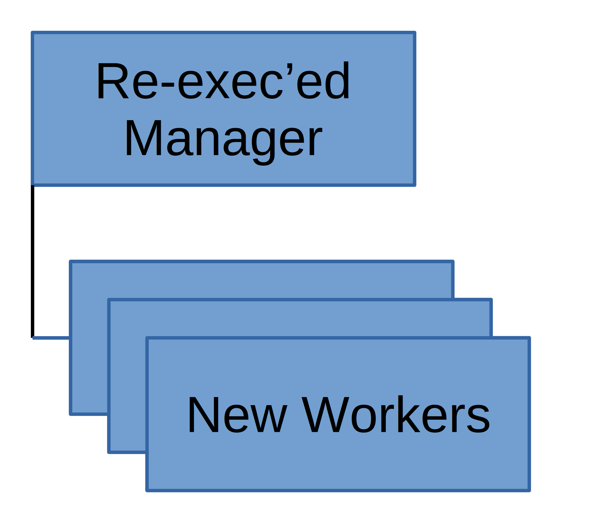

WSGI Server Seamless Reloads
============================

Beginning with Swift 2.24.0, WSGI servers support seamless reloads via
``SIGUSR1``. This allows servers to restart to pick up configuration or
code changes while being minimally-disruptive to clients. The process
is as follows:

1. Manager process receives ``USR1`` signal. This causes the process to fall
   out of its loop ensuring that all workers are running and instead begin
   reloading. The workers continue servicing client requests as long as
   their listen sockets remain open.

2. Manager process forks. The new child knows about all the existing
   workers and their listen sockets; it will be responsible for closing
   the old worker listen sockets so they stop accepting new connections.

3. Manager process re-exec's itself. It picks up new configuration and
   code while maintaining the same PID as the old manager process. At
   this point only the socket-closer is tracking the old workers.

4. New manager process forks off new workers, each with its own listen
   socket. Once all workers have started and can accept new connections,
   it notifies the socket-closer via a pipe. It closes the old worker
   listen sockets so they stop accepting new connections, passes the list
   of old workers to the new manager, then exits.

5. Old workers continue servicing any in-progress connections, while new
   connections are picked up by new workers. Once an old worker completes
   all of its oustanding requests, it exits. Beginning with Swift 2.33.0,
   if any workers persist beyond ``stale_worker_timeout``, the new manager
   will clean them up with ``KILL`` signals.

6. All old workers have now exited. Only new code and configs are in use.

``swift-reload``
----------------

Beginning with Swift 2.33.0, a new ``swift-reload`` helper is included
to help validate the reload process. Given a PID, it will

1. Validate that the PID seems to belong to a Swift WSGI server manager
   process,
2. Check that the config file used by that PID is currently valid,
3. Send the ``USR1`` signal to initiate a reload, and
4. Wait for the reload to complete before exiting.
